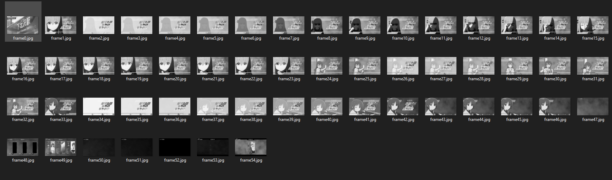

# Automatic Video Summarization

This Algorithm, Capturing frames from videos like this,

and making summarized new video.

You can change parameters.
```c++
VideoCapture cap("Video.mp4"); //video to summarize

double threshold = 10; //if increase the value, algorithm captures fewer frames

VideoWriter video_writer(video_name, VideoWriter::fourcc('M', 'J', 'P', 'G'), 10, prev_frame.size());
// You can change new video fps value from third parameter
```
